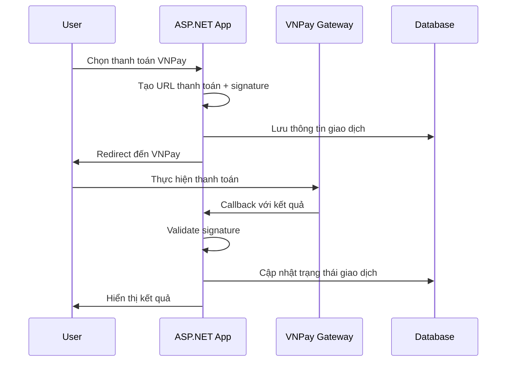
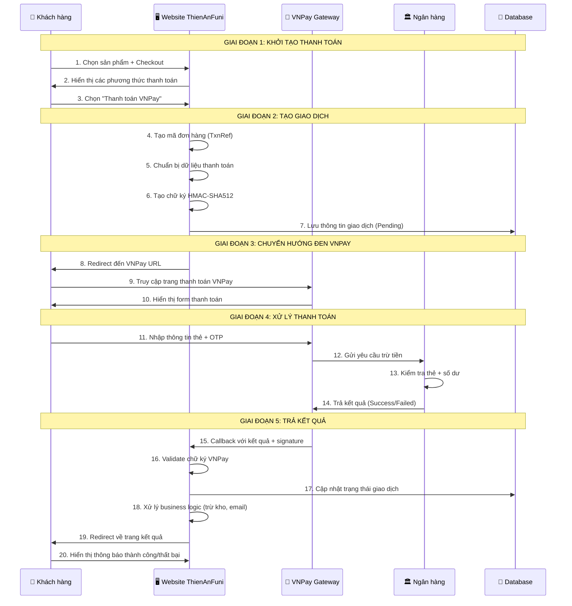

# VNPay Payment Integration Documentation

## 📋 Tổng quan

VNPay là một trong những cổng thanh toán trực tuyến hàng đầu tại Việt Nam, hỗ trợ thanh toán qua thẻ ATM nội địa, thẻ tín dụng quốc tế, ví điện tử và nhiều phương thức khác.

## 🎯 Tại sao cần tích hợp VNPay?

### 💰 **Lợi ích kinh doanh:**

1. **Tăng doanh thu**: Hỗ trợ nhiều phương thức thanh toán → tăng tỷ lệ conversion
2. **Mở rộng thị trường**: Tiếp cận khách hàng không có thẻ tín dụng (90%+ người Việt dùng thẻ ATM)
3. **Giảm rủi ro**: Không cần xử lý thông tin thẻ trực tiếp → tuân thủ PCI DSS
4. **Tăng uy tín**: Logo VNPay tạo niềm tin với khách hàng
5. **Tự động hóa**: Giảm thời gian xử lý đơn hàng thủ công

### 🛡️ **Lợi ích kỹ thuật:**

1. **Bảo mật cao**: Mã hóa HMAC-SHA512, SSL/TLS
2. **Tích hợp dễ dàng**: API đơn giản, documentation chi tiết
3. **Monitoring**: Dashboard theo dõi giao dịch real-time
4. **Hỗ trợ 24/7**: Team support của VNPay
5. **Scalable**: Xử lý được volume giao dịch lớn

### 📊 **Thống kê thị trường:**

- VNPay chiếm **40%+** thị phần thanh toán online Việt Nam
- Hỗ trợ **150+** ngân hàng và tổ chức tài chính
- Xử lý **10M+** giao dịch/tháng
- Uptime **99.9%+**

## 🔄 Quy trình VNPay hoạt động như thế nào?

### 📋 **Tổng quan quy trình:**

```
🛒 Khách hàng đặt hàng
         ↓
💻 Chọn thanh toán VNPay  
         ↓
🔐 Hệ thống tạo URL + chữ ký
         ↓
↗️ Redirect đến VNPay
         ↓
🏦 Khách nhập thông tin thẻ
         ↓
💳 VNPay xử lý với ngân hàng
         ↓
✅ Kết quả trả về website
         ↓
📧 Thông báo cho khách hàng
```

### 🔍 **Chi tiết từng bước:**

#### **Bước 1: Khách hàng khởi tạo thanh toán**

```
👤 Khách hàng: "Tôi muốn mua sản phẩm 500,000 VNĐ"
🛒 Website: "Bạn muốn thanh toán bằng cách nào?"
💳 Khách hàng: "Chọn VNPay"
```

#### **Bước 2: Website tạo yêu cầu thanh toán**

```
🖥️ Website tạo thông tin:
   - Số tiền: 500,000 VNĐ
   - Mã đơn hàng: ORD20250106001
   - Thông tin: "Thanh toán đơn hàng ORD20250106001"
   - Chữ ký bảo mật: HMAC-SHA512
```

#### **Bước 3: Chuyển hướng đến VNPay**

```
🔗 Website tạo URL VNPay:
https://sandbox.vnpayment.vn/paymentv2/vpcpay.html?
vnp_Amount=50000000&
vnp_Command=pay&
vnp_CreateDate=20250106143000&
vnp_CurrCode=VND&
vnp_IpAddr=192.168.1.1&
vnp_Locale=vn&
vnp_OrderInfo=Thanh+toan+don+hang+ORD20250106001&
vnp_OrderType=other&
vnp_ReturnUrl=https://yoursite.com/VNPay/Return&
vnp_TmnCode=95MBFDIE&
vnp_TxnRef=637789123456789&
vnp_Version=2.1.0&
vnp_SecureHash=abc123...
```

#### **Bước 4: Khách hàng thanh toán trên VNPay**

```
🏦 VNPay hiển thị:
   - Thông tin đơn hàng
   - Số tiền cần thanh toán
   - Lựa chọn ngân hàng/ví điện tử

👤 Khách hàng:
   - Chọn ngân hàng (NCB, Vietcombank, ...)
   - Nhập số thẻ ATM
   - Nhập mật khẩu
   - Nhập OTP
```

#### **Bước 5: VNPay xử lý với ngân hàng**

```
🏦 VNPay ↔ Ngân hàng:
   - Kiểm tra thông tin thẻ
   - Kiểm tra số dư
   - Thực hiện trừ tiền
   - Trả kết quả (Thành công/Thất bại)
```

#### **Bước 6: VNPay trả kết quả**

```
✅ Thành công:
   - Mã giao dịch: VNP20250106001
   - Thời gian: 2025-01-06 14:30:45
   - Số tiền: 500,000 VNĐ
   - Ngân hàng: NCB

❌ Thất bại:
   - Lý do: Không đủ số dư
   - Mã lỗi: 51
```

#### **Bước 7: Website xử lý kết quả**

```
🖥️ Website nhận callback:
   - Kiểm tra chữ ký hợp lệ
   - Cập nhật trạng thái đơn hàng
   - Gửi email xác nhận
   - Cập nhật kho hàng
   - Hiển thị kết quả cho khách
```

### 🎯 Mục tiêu tích hợp

- Tích hợp thanh toán VNPay vào ứng dụng ASP.NET Core 8.0 MVC
- Hỗ trợ thanh toán trực tuyến an toàn với chữ ký số HMAC-SHA512
- Xử lý callback và validate giao dịch tự động

## 🏗️ Kiến trúc tổng quan

```
[Client Browser] ↔ [ASP.NET Core App] ↔ [VNPay Gateway]
                           ↓
                    [Database & Logging]
```

### 📁 Cấu trúc thư mục

```
Services/VNPay/
├── VNPayService.cs          # Service chính xử lý VNPay
Models/VNPay/
├── VNPaySettings.cs         # Cấu hình VNPay
├── VNPayModels.cs          # Models request/response
Controllers/
├── VNPayController.cs       # Controller xử lý thanh toán
Views/VNPay/
├── CreatePayment.cshtml     # Trang tạo thanh toán
├── PaymentResult.cshtml     # Trang kết quả thanh toán
```

## ⚙️ Cấu hình hệ thống

### 1. Cấu hình trong `appsettings.Local.json`

```json
{
  "VNPaySettings": {
    "TmnCode": "95MBFDIE",
    "HashSecret": "914BN8G87HFJTJIZL5207QB4RX8S19PU",
    "PaymentUrl": "https://sandbox.vnpayment.vn/paymentv2/vpcpay.html",
    "ReturnUrl": "https://localhost:7108/VNPay/PaymentReturn",
    "Version": "2.1.0",
    "Command": "pay",
    "CurrCode": "VND",
    "Locale": "vn"
  }
}
```

### 2. Đăng ký Dependency Injection trong `Program.cs`

```csharp
// Cấu hình VNPay
builder.Services.Configure<VNPaySettings>(
    builder.Configuration.GetSection("VNPaySettings"));
builder.Services.AddScoped<IVNPayService, VNPayService>();
```

## 🔄 Luồng hoạt động chính

### 1. Khởi tạo thanh toán



### 2. Chi tiết từng bước

#### Bước 1: Tạo URL thanh toán

```csharp
public string CreatePaymentUrl(long amount, string orderInfo, string ipAddr)
{
    var tick = DateTime.Now.Ticks.ToString();
    var vnpay = new VNPayLibrary();

    // Thêm các tham số bắt buộc
    vnpay.AddRequestData("vnp_Version", _vnPaySettings.Version);
    vnpay.AddRequestData("vnp_Command", _vnPaySettings.Command);
    vnpay.AddRequestData("vnp_TmnCode", _vnPaySettings.TmnCode);
    vnpay.AddRequestData("vnp_Amount", (amount * 100).ToString());
    vnpay.AddRequestData("vnp_CreateDate", DateTime.Now.ToString("yyyyMMddHHmmss"));
    vnpay.AddRequestData("vnp_CurrCode", _vnPaySettings.CurrCode);
    vnpay.AddRequestData("vnp_IpAddr", ipAddr);
    vnpay.AddRequestData("vnp_Locale", _vnPaySettings.Locale);
    vnpay.AddRequestData("vnp_OrderInfo", orderInfo);
    vnpay.AddRequestData("vnp_OrderType", "other");
    vnpay.AddRequestData("vnp_ReturnUrl", _vnPaySettings.ReturnUrl);
    vnpay.AddRequestData("vnp_TxnRef", tick);

    return vnpay.CreateRequestUrl(_vnPaySettings.PaymentUrl, _vnPaySettings.HashSecret);
}
```

#### Bước 2: Tạo chữ ký HMAC-SHA512

```csharp
private static string HmacSHA512(string key, string inputData)
{
    var hash = new StringBuilder();
    byte[] keyBytes = Encoding.UTF8.GetBytes(key);
    byte[] inputBytes = Encoding.UTF8.GetBytes(inputData);
    using (var hmac = new HMACSHA512(keyBytes))
    {
        byte[] hashValue = hmac.ComputeHash(inputBytes);
        foreach (var theByte in hashValue)
        {
            hash.Append(theByte.ToString("x2"));
        }
    }
    return hash.ToString();
}
```

#### Bước 3: Xử lý callback từ VNPay

```csharp
public bool ValidateSignature(IQueryCollection queryParams, string hashSecret)
{
    var vnpay = new VNPayLibrary();
    foreach (var param in queryParams)
    {
        if (!string.IsNullOrEmpty(param.Value) && param.Key.StartsWith("vnp_"))
        {
            vnpay.AddResponseData(param.Key, param.Value.ToString());
        }
    }

    string vnp_SecureHash = queryParams["vnp_SecureHash"].ToString() ?? "";
    return vnpay.ValidateSignature(vnp_SecureHash, hashSecret);
}
```

## 🔐 Bảo mật và xác thực

### 1. Chữ ký số HMAC-SHA512

- **Mục đích**: Đảm bảo tính toàn vẹn và xác thực dữ liệu
- **Thuật toán**: HMAC-SHA512
- **Key**: HashSecret được cung cấp bởi VNPay
- **Data**: Chuỗi query string được sắp xếp theo thứ tự alphabet

### 2. Quy trình xác thực

1. **Gửi request**: Tạo signature từ request data + secret key
2. **Nhận response**: VNPay gửi kèm signature trong response
3. **Validate**: So sánh signature nhận được với signature tự tính toán

### 3. Các tham số bảo mật quan trọng

- `vnp_TmnCode`: Mã merchant (Terminal ID)
- `vnp_SecureHash`: Chữ ký HMAC-SHA512
- `vnp_TxnRef`: Mã tham chiếu giao dịch (unique)
- `vnp_CreateDate`: Timestamp tạo giao dịch

## 📝 Tham số API chính

### Request Parameters (Gửi đến VNPay)

| Tham số | Bắt buộc | Mô tả | Ví dụ |
|---------|----------|-------|-------|
| `vnp_Version` | ✅ | Phiên bản API | "2.1.0" |
| `vnp_Command` | ✅ | Loại giao dịch | "pay" |
| `vnp_TmnCode` | ✅ | Mã merchant | "95MBFDIE" |
| `vnp_Amount` | ✅ | Số tiền (VNĐ x 100) | 5000000 (50,000 VNĐ) |
| `vnp_CreateDate` | ✅ | Thời gian tạo | "20250106143000" |
| `vnp_CurrCode` | ✅ | Mã tiền tệ | "VND" |
| `vnp_IpAddr` | ✅ | IP khách hàng | "192.168.1.1" |
| `vnp_Locale` | ✅ | Ngôn ngữ | "vn" hoặc "en" |
| `vnp_OrderInfo` | ✅ | Thông tin đơn hàng | "Thanh toan don hang #12345" |
| `vnp_OrderType` | ✅ | Loại đơn hàng | "other" |
| `vnp_ReturnUrl` | ✅ | URL callback | "<https://domain.com/vnpay/return>" |
| `vnp_TxnRef` | ✅ | Mã tham chiếu | Timestamp hoặc UUID |
| `vnp_SecureHash` | ✅ | Chữ ký HMAC | Hash string |

### Response Parameters (Nhận từ VNPay)

| Tham số | Mô tả | Ví dụ |
|---------|-------|-------|
| `vnp_Amount` | Số tiền giao dịch | "5000000" |
| `vnp_BankCode` | Mã ngân hàng | "NCB" |
| `vnp_BankTranNo` | Mã giao dịch ngân hàng | "VNP01234567" |
| `vnp_CardType` | Loại thẻ | "ATM" |
| `vnp_OrderInfo` | Thông tin đơn hàng | "Thanh toan don hang #12345" |
| `vnp_PayDate` | Thời gian thanh toán | "20250106143045" |
| `vnp_ResponseCode` | Mã kết quả | "00" (thành công) |
| `vnp_TmnCode` | Mã merchant | "95MBFDIE" |
| `vnp_TransactionNo` | Mã giao dịch VNPay | "14266742" |
| `vnp_TransactionStatus` | Trạng thái giao dịch | "00" (thành công) |
| `vnp_TxnRef` | Mã tham chiếu | Giống request |
| `vnp_SecureHash` | Chữ ký xác thực | Hash string |

## 📊 Mã trạng thái và xử lý lỗi

### Mã Response Code từ VNPay

| Code | Ý nghĩa | Xử lý |
|------|---------|-------|
| `00` | Giao dịch thành công | Cập nhật đơn hàng thành công |
| `07` | Trừ tiền thành công, giao dịch bị nghi ngờ | Cần kiểm tra thủ công |
| `09` | Thẻ chưa đăng ký SMS Banking | Thông báo lỗi cho khách |
| `10` | Xác thực thông tin thẻ sai quá 3 lần | Thông báo lỗi bảo mật |
| `11` | Đã hết hạn chờ thanh toán | Tạo lại giao dịch |
| `12` | Thẻ bị khóa | Thông báo liên hệ ngân hàng |
| `13` | Sai mật khẩu xác thực giao dịch | Thử lại |
| `24` | Khách hàng hủy giao dịch | Cập nhật trạng thái hủy |
| `51` | Tài khoản không đủ số dư | Thông báo không đủ tiền |
| `65` | Tài khoản bị vượt quá hạn mức | Thông báo hạn mức |
| `75` | Ngân hàng bảo trì | Thử lại sau |
| `79` | KH nhập sai mật khẩu quá số lần quy định | Thông báo lỗi bảo mật |
| `99` | Lỗi không xác định | Liên hệ hỗ trợ |

### Xử lý trong Controller

```csharp
public IActionResult PaymentReturn()
{
    var queryParams = Request.Query;
    bool isValidSignature = _vnPayService.ValidateSignature(queryParams, _vnPaySettings.HashSecret);
    
    if (!isValidSignature)
    {
        return View("PaymentResult", new VNPayPaymentResult 
        { 
            Success = false, 
            Message = "Chữ ký không hợp lệ" 
        });
    }
    
    string responseCode = queryParams["vnp_ResponseCode"].ToString() ?? "";
    string transactionStatus = queryParams["vnp_TransactionStatus"].ToString() ?? "";
    
    if (responseCode == "00" && transactionStatus == "00")
    {
        // Xử lý thanh toán thành công
        ProcessSuccessfulPayment(/* parameters */);
        return View("PaymentResult", new VNPayPaymentResult 
        { 
            Success = true, 
            Message = "Thanh toán thành công" 
        });
    }
    else
    {
        // Xử lý thanh toán thất bại
        ProcessFailedPayment(/* parameters */);
        return View("PaymentResult", new VNPayPaymentResult 
        { 
            Success = false, 
            Message = GetVNPayResponseMessage(responseCode) 
        });
    }
}
```

## 🧪 Môi trường Test

### Thông tin Test Sandbox

- **URL**: <https://sandbox.vnpayment.vn/paymentv2/vpcpay.html>
- **Terminal ID**: 95MBFDIE
- **Hash Secret**: 914BN8G87HFJTJIZL5207QB4RX8S19PU
- **Admin URL**: <https://sandbox.vnpayment.vn/merchantv2/>
- **Account**: <khoahotboy12345@gmail.com>

### Thẻ Test

- **Ngân hàng**: NCB (National Citizen Bank)
- **Số thẻ**: 9704198526191432198
- **Tên chủ thẻ**: NGUYEN VAN A
- **Ngày hết hạn**: 07/15
- **OTP**: 123456

### Test Cases

1. **Thanh toán thành công**: Sử dụng thẻ test với thông tin đúng
2. **Thanh toán thất bại**: Nhập sai OTP hoặc hủy giao dịch
3. **Signature validation**: Test với signature sai
4. **Timeout**: Test với giao dịch quá thời gian chờ

## 🚀 Triển khai Production

### 1. Cấu hình Production

```json
{
  "VNPaySettings": {
    "TmnCode": "YOUR_REAL_TMN_CODE",
    "HashSecret": "YOUR_REAL_HASH_SECRET",
    "PaymentUrl": "https://vnpayment.vn/paymentv2/vpcpay.html",
    "ReturnUrl": "https://yourdomain.com/VNPay/PaymentReturn",
    "Version": "2.1.0",
    "Command": "pay",
    "CurrCode": "VND",
    "Locale": "vn"
  }
}
```

### 2. SSL/HTTPS Requirements

- **Bắt buộc**: Tất cả URL callback phải sử dụng HTTPS
- **Certificate**: SSL certificate hợp lệ và được trust
- **Security**: Không expose HashSecret trong client-side code

### 3. Logging và Monitoring

```csharp
public class VNPayService : IVNPayService
{
    private readonly ILogger<VNPayService> _logger;
    
    public string CreatePaymentUrl(long amount, string orderInfo, string ipAddr)
    {
        _logger.LogInformation("Creating VNPay payment URL for amount: {Amount}, orderInfo: {OrderInfo}", 
            amount, orderInfo);
        
        // Implementation...
        
        _logger.LogInformation("VNPay payment URL created: {Url}", paymentUrl);
        return paymentUrl;
    }
    
    public bool ValidateSignature(IQueryCollection queryParams, string hashSecret)
    {
        _logger.LogInformation("Validating VNPay signature for transaction: {TxnRef}", 
            queryParams["vnp_TxnRef"]);
            
        bool isValid = /* validation logic */;
        
        if (!isValid)
        {
            _logger.LogWarning("Invalid VNPay signature detected for transaction: {TxnRef}", 
                queryParams["vnp_TxnRef"]);
        }
        
        return isValid;
    }
}
```

## 🔧 Best Practices

### 1. Bảo mật

- ✅ Luôn validate signature từ VNPay
- ✅ Không hardcode HashSecret trong code
- ✅ Sử dụng HTTPS cho tất cả endpoints
- ✅ Log tất cả giao dịch để audit
- ✅ Implement rate limiting cho payment endpoints

### 2. Xử lý lỗi

- ✅ Graceful handling cho network timeouts
- ✅ Retry mechanism cho failed requests
- ✅ User-friendly error messages
- ✅ Fallback payment methods

### 3. Performance

- ✅ Cache VNPay settings
- ✅ Async/await cho HTTP calls
- ✅ Connection pooling
- ✅ Minimize payload size

### 4. Testing

- ✅ Unit tests cho VNPayService
- ✅ Integration tests với VNPay sandbox
- ✅ Load testing cho payment flows
- ✅ Security testing cho signature validation

## 📚 Tài liệu tham khảo

- [VNPay API Documentation](https://sandbox.vnpayment.vn/apis/docs/thanh-toan-pay/pay.html)
- [VNPay Demo Code](https://sandbox.vnpayment.vn/apis/vnpay-demo/code-demo-tích-hợp)
- [ASP.NET Core Documentation](https://docs.microsoft.com/en-us/aspnet/core/)
- [HMAC-SHA512 Specification](https://tools.ietf.org/html/rfc4231)

## 📞 Hỗ trợ

- **VNPay Hotline**: 1900 55 522 5
- **Email**: <support@vnpay.vn>
- **Developer Portal**: <https://sandbox.vnpayment.vn/>

---

*Tài liệu này được tạo cho dự án ThienAnFuni - Cập nhật lần cuối: 06/01/2025*

### 🎨 **Sơ đồ trực quan chi tiết:**



### 🏗️ **Kiến trúc hệ thống chi tiết:**

```
┌─────────────────────────────────────────────────────────────────┐
│                    🌐 INTERNET                                   │
└─────────────────────────────────────────────────────────────────┘
                              │
                              ▼
┌─────────────────────────────────────────────────────────────────┐
│                   🔒 HTTPS/SSL LAYER                            │
└─────────────────────────────────────────────────────────────────┘
                              │
                              ▼
┌─────────────────┐    ┌─────────────────┐    ┌─────────────────┐
│   👤 Browser    │◄──►│  🖥️ Web Server   │◄──►│  🏦 VNPay API   │
│                 │    │                 │    │                 │
│ • React/jQuery  │    │ • ASP.NET Core  │    │ • REST API      │
│ • HTML Forms    │    │ • VNPayService  │    │ • HMAC-SHA512   │
│ • JavaScript    │    │ • Controllers   │    │ • JSON Response │
└─────────────────┘    └─────────────────┘    └─────────────────┘
                              │
                              ▼
┌─────────────────────────────────────────────────────────────────┐
│                   💾 DATABASE LAYER                             │
│                                                                 │
│ ┌─────────────┐  ┌─────────────┐  ┌─────────────┐              │
│ │   Orders    │  │ Transactions│  │    Logs     │              │
│ │             │  │             │  │             │              │
│ │ • OrderId   │  │ • TxnRef    │  │ • Timestamp │              │
│ │ • Amount    │  │ • Status    │  │ • Request   │              │
│ │ • Status    │  │ • VNPay ID  │  │ • Response  │              │
│ └─────────────┘  └─────────────┘  └─────────────┘              │
└─────────────────────────────────────────────────────────────────┘
```

### 💡 **Tại sao VNPay lại hoạt động theo cách này?**

#### **🔒 Lý do bảo mật:**

1. **Không lưu trữ thông tin thẻ**: Website không bao giờ nhận thông tin thẻ của khách hàng
2. **Chữ ký số**: Mọi request/response đều có chữ ký để tránh giả mạo
3. **Redirect pattern**: Khách hàng chỉ nhập thông tin trên domain VNPay (SSL)
4. **PCI DSS compliant**: VNPay đã được chứng nhận bảo mật quốc tế

#### **⚡ Lý do hiệu suất:**

1. **Stateless**: Không cần maintain session giữa các request
2. **Callback async**: Không block UI trong khi xử lý thanh toán
3. **Load balancing**: VNPay có thể xử lý hàng triệu giao dịch đồng thời
4. **Caching**: Giảm tải cho database bằng cách cache settings

#### **🎯 Lý do business:**

1. **Trust & Brand**: Logo VNPay tạo niềm tin với khách hàng
2. **Coverage**: Hỗ trợ 99% ngân hàng tại VN
3. **Support**: Team hỗ trợ 24/7 khi có vấn đề
4. **Reporting**: Dashboard theo dõi giao dịch chi tiết

### 🎭 **Kịch bản thực tế:**

#### **📱 Kịch bản 1: Mua hàng thành công**

```
🕐 14:30:00 - Khách hàng Nguyễn Văn A vào website
🕐 14:30:15 - Chọn iPhone 15 Pro Max - 25,000,000 VNĐ  
🕐 14:30:30 - Click "Thanh toán" → Chọn VNPay
🕐 14:30:35 - Hệ thống tạo URL: vnp_TxnRef=637789123456789
🕐 14:30:36 - Redirect đến VNPay
🕐 14:30:40 - Khách nhập thẻ NCB: 9704198526191432198
🕐 14:30:50 - Nhập OTP: 123456
🕐 14:31:00 - VNPay xử lý với ngân hàng NCB
🕐 14:31:05 - Trừ tiền thành công
🕐 14:31:06 - VNPay callback: ResponseCode=00
🕐 14:31:07 - Website validate signature ✅
🕐 14:31:08 - Cập nhật order: Status = "Paid"
🕐 14:31:09 - Trừ kho: iPhone 15 Pro Max (-1)
🕐 14:31:10 - Gửi email: "Đơn hàng #12345 đã thanh toán thành công"
🕐 14:31:11 - Hiển thị: "Cảm ơn bạn! Đơn hàng sẽ được giao trong 24h"
```

#### **❌ Kịch bản 2: Thanh toán thất bại**

```
🕐 15:45:00 - Khách hàng Trần Thị B chọn mua Laptop - 15,000,000 VNĐ
🕐 15:45:20 - Chọn VNPay → Redirect thành công
🕐 15:45:30 - Nhập thẻ Vietcombank: 9704198526191432199
🕐 15:45:40 - Nhập OTP sai: 654321
🕐 15:45:45 - VNPay trả về: ResponseCode=13 (Sai OTP)
🕐 15:45:46 - Website nhận callback với lỗi
🕐 15:45:47 - Cập nhật order: Status = "Failed"
🕐 15:45:48 - Hiển thị: "Thanh toán thất bại. Vui lòng thử lại!"
🕐 15:45:49 - Gửi email: "Đơn hàng #12346 chưa được thanh toán"
```

### 📈 **ROI (Return on Investment) khi tích hợp VNPay:**

#### **💰 Chi phí:**

- Setup fee: 0 VNĐ (miễn phí)
- Transaction fee: 1.5-2.5% mỗi giao dịch
- Development time: ~3-5 ngày (1 developer)

#### **💎 Lợi nhuận:**

- Tăng conversion rate: +25-40%
- Giảm cart abandonment: -30%
- Tăng khách hàng mới: +20%
- Giảm thời gian xử lý đơn: -80%

#### **📊 Ví dụ thực tế:**

```
Website bán hàng có:
- 1000 visitors/ngày
- Conversion rate hiện tại: 2% = 20 orders
- Average order value: 500,000 VNĐ
- Doanh thu/ngày: 10,000,000 VNĐ

Sau khi tích hợp VNPay:
- Conversion rate tăng lên: 2.8% = 28 orders  
- Doanh thu/ngày: 14,000,000 VNĐ
- Tăng trưởng: +4,000,000 VNĐ/ngày
- Phí VNPay (2%): -280,000 VNĐ/ngày
- Lợi nhuận ròng: +3,720,000 VNĐ/ngày

→ ROI = 1,330% per day! 🚀
```
